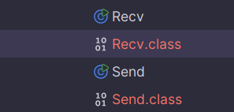

# RabbitMQ

---

## Experiment 1: Installing and Setting Up RabbitMQ using Docker
I already had [Docker Desktop](https://www.docker.com/products/docker-desktop/) downloaded and installed on my machine,
so I started with opening it. After that, I opened a browser and typed "docker hub" in the search bar and clicked on the
link for the [Docker Hub Container Image Library](https://hub.docker.com/).

Then I searched for RabbitMQ in the search bar and clicked on the top-most result, which was the official image library
for RabbitMQ. This took me to the page for the RabbitMQ Docker Image, where I scrolled down to "Supported Tags and
Respective `Dockerfile` links" and scrolled down to the second link from the top which read

`4.0.2-management, 4.0-management, 4-management, management`

I copied the first image name `4.0.2-management` and then I opened the command prompt as admin and ran the command:

`docker pull rabbitmq:4.0.2-management`

and the image started downloading

 ```
 Microsoft Windows [Version 10.0.22631.4169]
(c) Microsoft Corporation. Med enerett.

C:\Windows\System32>docker --version
Docker version 27.1.1, build 6312585

C:\Windows\System32>docker pull rabbitmq:4.0.2-management
4.0.2-management: Pulling from library/rabbitmq
dafa2b0c44d2: Pull complete
0ae94e6aef35: Extracting  37.16MB/45.45MB
2ad525572aae: Download complete
c01adf267ddc: Download complete
14495391f6cb: Download complete
8666b435d033: Download complete
37a05209e70f: Download complete
dc90a98e5e04: Download complete
45842602427a: Download complete
953a6cb82879: Download complete
 ```

After downloading, I opened `Docker` and checked that the image was there, which it was. I could have simply used the
Docker Desktop to run the RabbitMQ image in a new container, but I chose to run it through the terminal using the
command

`docker run --rm -it -p 15672:15672 -p 5672:5672 rabbitmq:4.0.2-management`

This command is mapping and exporting the port 15672 (default) for the RabbitMQ management website (plugin), and the 
second for the RabbitMQ client connections (broker). This gave me a long output which ended with the lines

```
2024-10-01 16:06:40.167168+00:00 [info] <0.635.0> Server startup complete; 4 plugins started.
2024-10-01 16:06:40.167168+00:00 [info] <0.635.0>  * rabbitmq_prometheus
2024-10-01 16:06:40.167168+00:00 [info] <0.635.0>  * rabbitmq_management
2024-10-01 16:06:40.167168+00:00 [info] <0.635.0>  * rabbitmq_management_agent
2024-10-01 16:06:40.167168+00:00 [info] <0.635.0>  * rabbitmq_web_dispatch
 completed with 4 plugins.
2024-10-01 16:06:40.343648+00:00 [info] <0.9.0> Time to start RabbitMQ: 13600 ms
```

I checked that the server was running by opening the browser and going to `localhost:15672` which opened the RabbitMQ
management website (which prompted for a username and password).

--- 

## Experiment 2: Hello World
When implementing the tutorial, I encountered my first mvobstacle when running

`javac -cp amqp-client-5.22.0.jar Recv.java Send.java`

I got an error saying

```
error: file not found: Send.java
Usage: javac <options> <source files>
use --help for a list of possible options
```

I solved this by cd'ing into the dir where the .java files are stored but got new error now. Because the compiler
cannot find the Java Client lib or its dependencies, I got an error on every line where I used functions from them.

```
Send.java:4: error: package com.rabbitmq.client does not exist
import com.rabbitmq.client.ConnectionFactory;
                          ^
Send.java:5: error: package com.rabbitmq.client does not exist
import com.rabbitmq.client.Connection;
                          ^
Send.java:6: error: package com.rabbitmq.client does not exist
import com.rabbitmq.client.Channel;
                          ^
Recv.java:3: error: package com.rabbitmq.client does not exist
import com.rabbitmq.client.Channel;
                          ^
Recv.java:4: error: package com.rabbitmq.client does not exist
import com.rabbitmq.client.Connection;
                          ^
Recv.java:5: error: package com.rabbitmq.client does not exist
import com.rabbitmq.client.ConnectionFactory;
                          ^
Recv.java:6: error: package com.rabbitmq.client does not exist
import com.rabbitmq.client.DeliverCallback;
                          ^
Send.java:17: error: cannot find symbol
        ConnectionFactory factory = new ConnectionFactory();
        ^
  symbol:   class ConnectionFactory
  location: class Send
Send.java:17: error: cannot find symbol
        ConnectionFactory factory = new ConnectionFactory();
                                        ^
  symbol:   class ConnectionFactory
  location: class Send
Send.java:22: error: cannot find symbol
        try ( Connection connection = factory.newConnection(); // Connect to a RabbitMQ node to the factory variable
              ^
  symbol:   class Connection
  location: class Send
Send.java:23: error: cannot find symbol
              Channel channel = connection.createChannel()) {  // Create the channel
              ^
  symbol:   class Channel
  location: class Send
Recv.java:18: error: cannot find symbol
        ConnectionFactory factory = new ConnectionFactory();
        ^
  symbol:   class ConnectionFactory
  location: class Recv
Recv.java:18: error: cannot find symbol
        ConnectionFactory factory = new ConnectionFactory();
                                        ^
  symbol:   class ConnectionFactory
  location: class Recv
Recv.java:24: error: cannot find symbol
        Connection connection = factory.newConnection();
        ^
  symbol:   class Connection
  location: class Recv
Recv.java:27: error: cannot find symbol
        Channel channel = connection.createChannel();
        ^
  symbol:   class Channel
  location: class Recv
Recv.java:34: error: cannot find symbol
        DeliverCallback deliverCallback = (consumerTag, delivery) -> {
        ^
  symbol:   class DeliverCallback
  location: class Recv
16 errors
```

I thought maybe I had to configure the whole path like so

`javac -cp amqp-client-5.22.0.jar dat250/ex6/springboot_rabbitmq_tutorial/Send.java dat250/ex6/springboot_rabbitmq_tutorial/Recv.java`

But `javac` still could not find it form the folder where the classes are stored, or form the package folder.

Next, I tried to add `Maven` support to my project by clicking `Ctrl + Shift + A`, searching for `Add Framework 
Support`, and then selecting `Maven`. This created a `pom.xml` in which I had to specify the `groupId`, that is, I had to
change `groupId` to the package name `dat250.ex6.springboot_rabbitmq_tutorial` and added the dependency:

```
<dependency>
  <groupId>com.rabbitmq</groupId>
  <artifactId>amqp-client</artifactId>
  <version>5.22.0</version>
</dependency>
```

After this, I rebuilt the project and ran it with the commands

```
$ ./gradlew build
$ ./gradlew bootRun
```

to confirm that it was still running without errors.

After this, I tried cd'ing into the dir where the .java files are stored and ran the command

`javac -cp amqp-client-5.22.0.jar Send.java Recv.java`

But I still got the same error: ` error: package com.rabbitmq.client does not exist`

So, I moved my `lib`-folder to the same directory as where my java-classes where stored, i.e., to
`dat250.ex6.springboot_rabbitmq_tutorial` and tried again, only this time I changed the order of the classes, so that
`Recv.java` would compile first with the line

`javac -cp amqp-client-5.22.0.jar Send.java Recv.java`

This time, the code compiled and I got two new files `Recv.class` and `Send-class`



---

## Experiment 2: Hello World (again)

I had many issues getting the code to run, and after several failed attempts, and spending a lot of time writing
overcomplicated code, I decided to try again from scratch. 

This time, I did not waste my time overcomplicating things, I only added a few lines of code in the `build.gradle.kts` 
file. 

I added the needed dependencies with (only) one line, `implementation("com.rabbitmq:amqp-client:5.22.0")`, instead 
of downloading the three `.jar`-files which were recommended in the tutorial. 

I also added some `tasks` to run the code:

```
tasks.register<JavaExec>("runSender"){
	group="rabbitmq.project"
	mainClass.set("rabbitmq.project.rabbitmq_project.Send")
	classpath = sourceSets["main"].runtimeClasspath
}

tasks.register<JavaExec>("runReceiver"){
	group="rabbitmq.project"
	mainClass.set("rabbitmq.project.rabbitmq_project.Recv")
	classpath = sourceSets["main"].runtimeClasspath
}
```
After which, I opened two terminals where I compiled and ran the code successfully.

```
$ ./gradlew runSender
Starting a Gradle Daemon (subsequent builds will be faster)

> Task :runSender
 [x] Sent 'Hello World!'

BUILD SUCCESSFUL in 38s
3 actionable tasks: 2 executed, 1 up-to-date

```

```
$ ./gradlew runReceiver
Starting a Gradle Daemon, 1 busy Daemon could not be reused, use --status for details

> Task :runReceiver
 [*] Waiting for messages. To exit press CTRL+C
 [x] Received 'Hello World!'
<=========----> 75% EXECUTING [1m 17s]
> :runReceiver

```

---

## Experiment 3: Work Queues
I created the two new java classes and added two new tasks in  `build.gradle.kts` to compile and run them. Then, I 
opened three terminals, two receivers/workers/consumers and one sender. I sent some messages(names) 
through and got the expected output. 

**Sender**:
```
$ ./gradlew runNewTask --args="Alice"
Starting a Gradle Daemon, 2 busy and 10 stopped Daemons could not be reused, use --status for details

> Task :runNewTask
 [x] Sent 'Alice'

BUILD SUCCESSFUL in 32s
3 actionable tasks: 1 executed, 2 up-to-date
```

**Worker 1:**
```
$ ./gradlew runWorker

> Task :runWorker
 [*] Waiting for messages. To exit press CTRL+C
 [x] Received 'Alice'
 [x] Done
 [x] Received 'Charlie'
 [x] Done
 [x] Received 'Eva'
 [x] Done
 [x] Received 'Gina'
 [x] Done
 [x] Received 'Inga'
 [x] Done
 [x] Received 'Klaus'
 [x] Done
 [x] Received 'Nina'
 [x] Done
<=========----> 75% EXECUTING [5m 30s]
> :runWorker

```

**Worker 2:**
```
$ ./gradlew runWorker
Starting a Gradle Daemon, 1 busy and 10 stopped Daemons could not be reused, use --status for details

> Task :runWorker
 [*] Waiting for messages. To exit press CTRL+C
 [x] Received 'Bob'
 [x] Done
 [x] Received 'Diana'
 [x] Done
 [x] Received 'Frank'
 [x] Done
 [x] Received 'Henry'
 [x] Done
 [x] Received 'Jack'
 [x] Done
 [x] Received 'Marge'
 [x] Done
<=========----> 75% EXECUTING [5m 54s]
> :runWorker
```